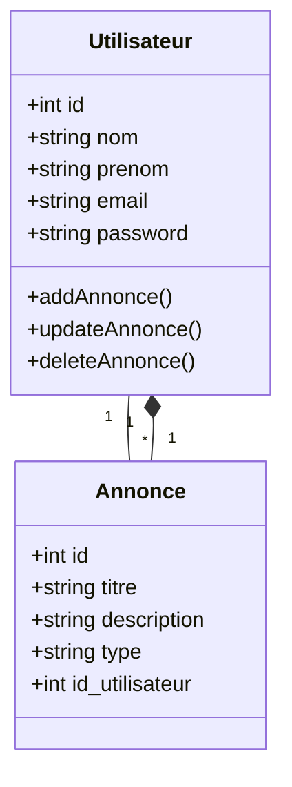

```mermaid
classDiagram
class Utilisateur{
    +int id
    +string nom
    +string prenom
    +string email
    +string password
    +addAnnonce() 
    +updateAnnonce()
    +deleteAnnonce()
}
class Annonce{
    +int id 
    +string titre
    +string description
    +string type
    +int id_utilisateur
}
 Annonce "1" --*  "1" Utilisateur
 Utilisateur "1" -- "*" Annonce
     

```